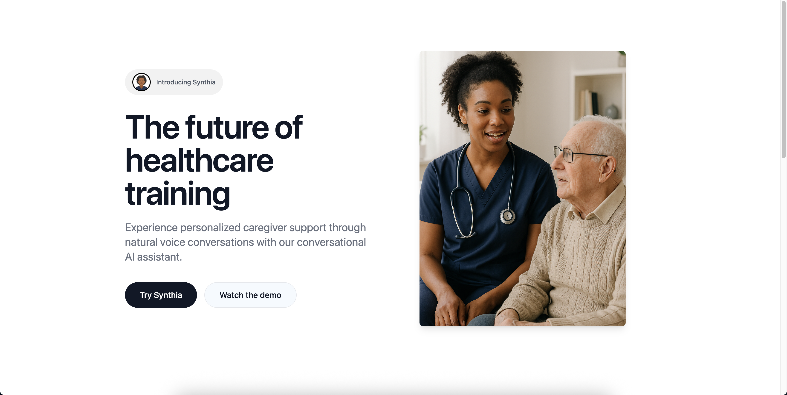
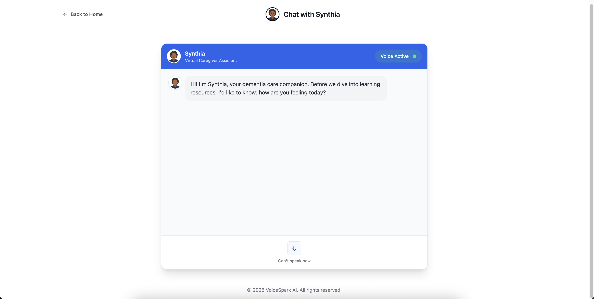

# Synthia - AI-Powered Healthcare Assistant


A sophisticated conversational AI platform designed to provide personalized support for healthcare professionals and caregivers, with a special focus on dementia care.

## Overview

Synthia combines advanced AI capabilities with healthcare expertise to deliver an empathetic and intelligent virtual assistant. The platform leverages state-of-the-art language models and voice processing technologies to provide meaningful support in healthcare scenarios.

## Demo & Visuals

### Video Demo
[](https://www.loom.com/share/b0935f9d8f7b40518a36d53fe47cc6b8)

### Chat Interface


## Technical Architecture

### AI & Voice Processing Stack
- **Language Model**: OpenAI GPT-4 API for contextual understanding and natural conversation
- **Speech-to-Text**: OpenAI Whisper API for accurate voice transcription
- **Text-to-Speech**: ElevenLabs API for natural, human-like voice synthesis
- **Audio Processing**: Web Audio API for real-time audio handling and playback

### Core AI Features
- Real-time voice recognition using OpenAI Whisper
- Natural voice synthesis powered by ElevenLabs
- Contextual AI responses using OpenAI GPT-4
- Seamless voice conversation pipeline
- Healthcare-specific conversation context

### Project Structure
```
src/
├── services/      # AI and voice processing integrations
│   ├── ai-services.ts    # OpenAI GPT-4 integration
│   ├── speech-to-text.ts # OpenAI Whisper integration
│   └── text-to-speech.ts # ElevenLabs integration
└── types/         # TypeScript type definitions
```

## Setup

### Environment Variables
Create a `.env` file with the following variables:
```
# OpenAI API Configuration
VITE_OPENAI_API_KEY=your_openai_api_key

# ElevenLabs Configuration
VITE_ELEVENLABS_API_KEY=your_elevenlabs_api_key
VITE_ELEVENLABS_VOICE_ID=your_voice_id
```

## Next Steps

### Immediate Priorities
1. Implement comprehensive error handling for AI service failures
2. Expand the healthcare knowledge base with domain-specific training
3. Optimize voice processing latency
4. Implement conversation history persistence
5. Add fallback mechanisms for API outages

### Future Enhancements
1. Multi-language support with Whisper's multilingual capabilities
2. Custom voice model training with ElevenLabs
3. Fine-tuned GPT models for healthcare-specific responses
4. Integration with healthcare APIs for real-time data
5. Advanced conversation analytics and insights
6. Custom model training for healthcare scenarios
